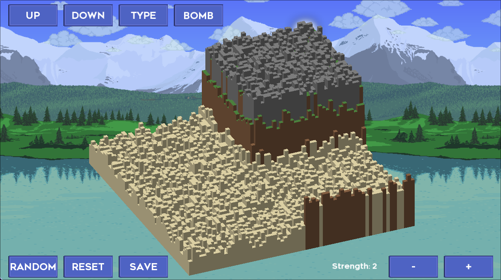

# My World

A 3D isometric map editor made in 2 weeks in collaboration with [AlexNumberss](https://github.com/AlexNumberss), for a school project. This project uses C23 with the CSFML library (version 2.6), the official binding of SFML for C. It was made under school constraints, like a specific coding style that students must follow, and other projects due for the same date.



## Usage/Examples

```
$ ./my_world -h
Usage: ./my_world [-h|--help] [-s height width] [-f filename]

How to move the camera:
- Arrow keys to move the camera
- Q and D to rotate the camera
- Z and S to zoom in and out
- Shift or Ctrl to change movement speed

How to modify the world:
- Right click to select a block
- Click on a button to activate an effect
- More informations about the effects/shortcuts in the tooltips
```

## How to compile/run

Make sure that CSFML version 2.6 is installed on your system.
Then, simply use make to compile the program:

```bash
make -j
```

And then run the resulting binary, in this case, `my_world`.
